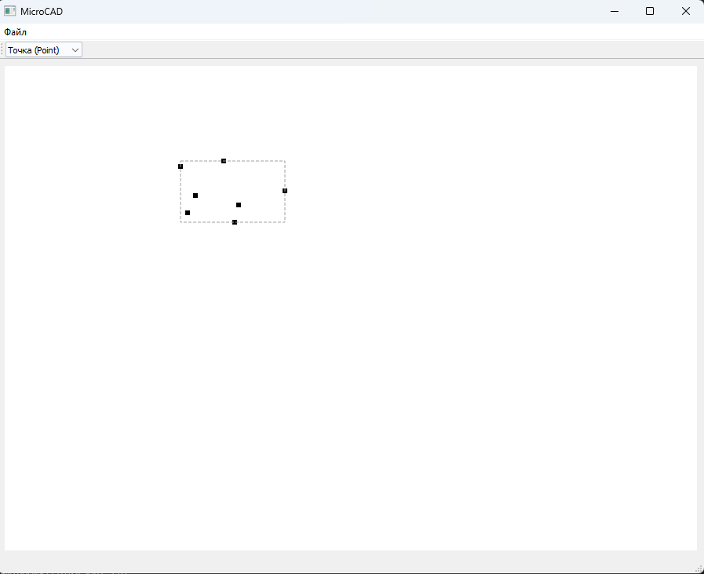
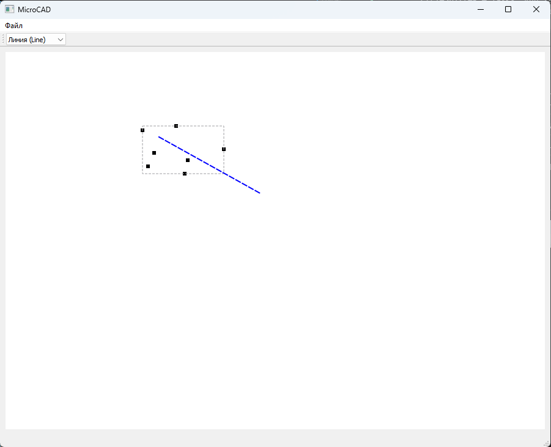
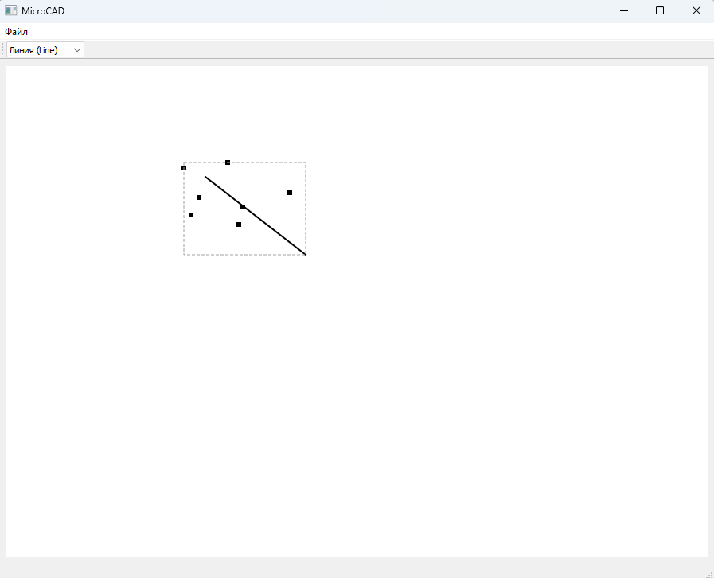
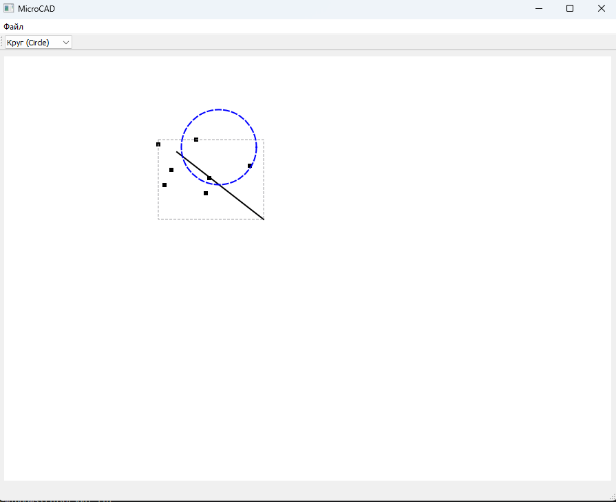
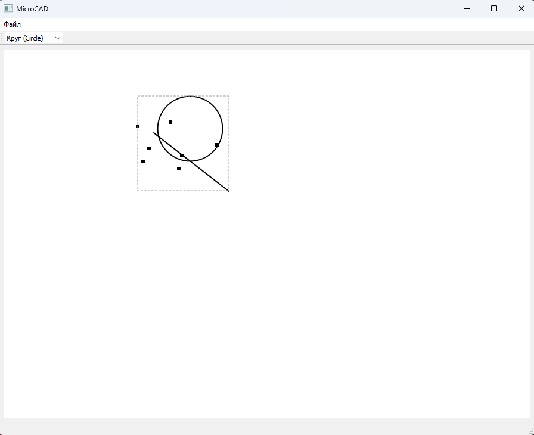
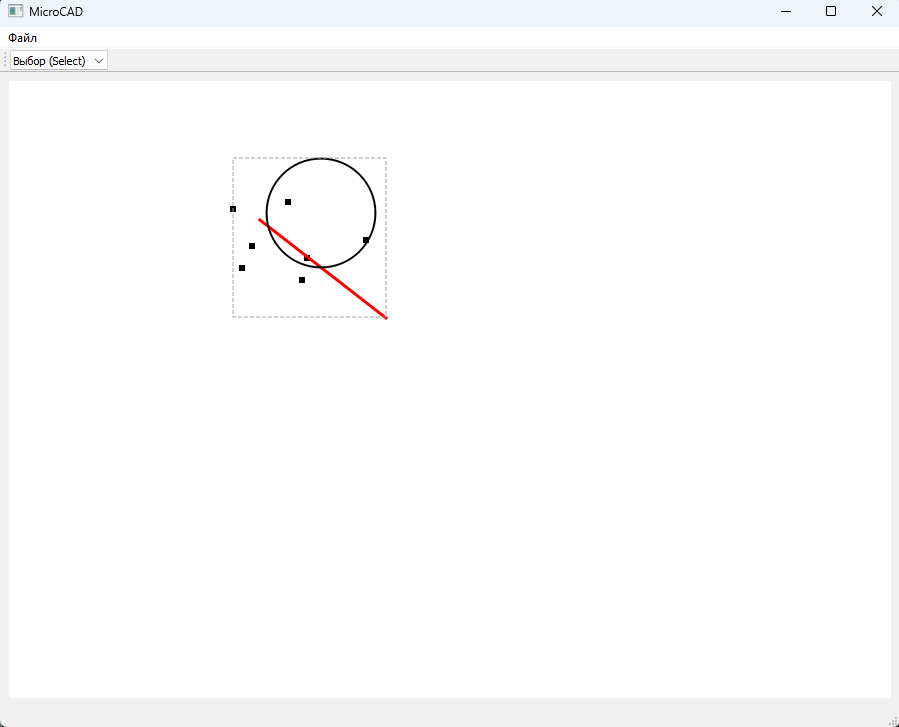
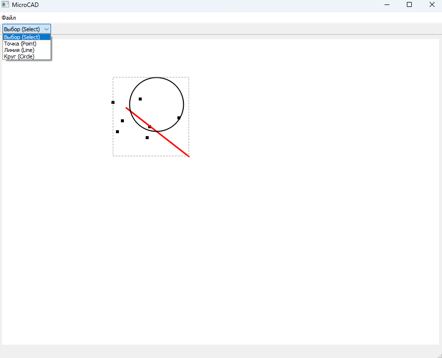
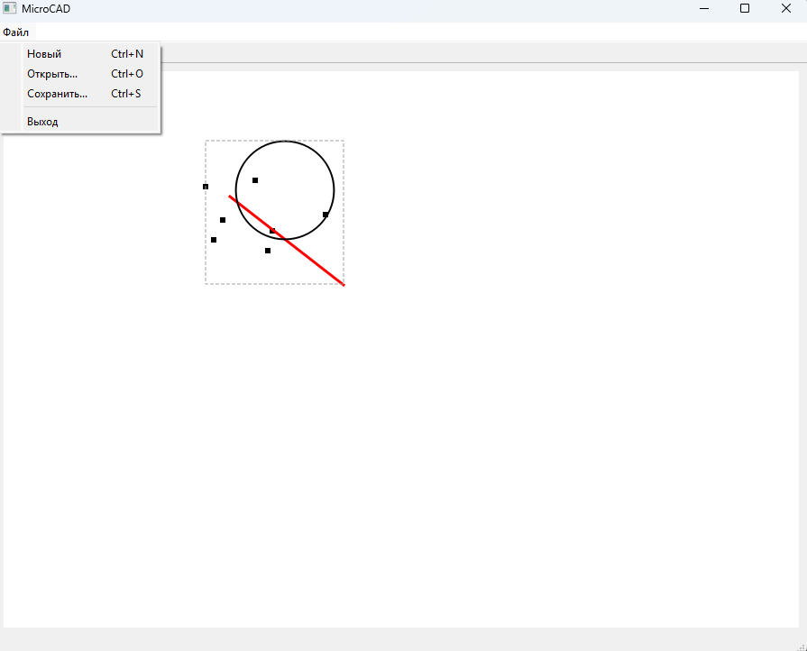

# MicroCAD

## Описание
MicroCAD — это консольный и GUI-векторный редактор C++17, созданный по принципам ООП, паттернов проектирования и работы с графическими примитивами. Проект имитирует базовую функциональность систем автоматизированного проектирования (САПР).

## Возможности
- Создание примитивов: **Точка**, **Линия**, **Круг**
- Сериализация в JSON (сохранение/загрузка чертежей)
- **GUI на Qt5** с поддержкой:
  - Выбор фигуры мышью (подсветка красным)
  - Рисование новых фигур (точка — 1 клик, линия/окружность — 2 клика)
  - Предпросмотр при рисовании
  - Отображение прямоугольника, охватывающий все фигуры (Bounding Box)

## Технологии
| Компонент | Технология |
|-----------|-----------|
| Язык | C++17 |
| GUI | Qt5 (QPainter, QWidget) |
| Сериализация | nlohmann/json |
| Сборка | MSVC/cl.exe + tasks.json |

## Структура проекта
MicroCAD/
├── include/ # Заголовочные файлы

├── gui/ # Qt виджеты

├── tests/ # Модульные тесты

├── data/ # Сохранённые чертежи (JSON)

├── main.cpp # Консольная версия

└── main_qt.cpp # GUI версия


## Сборка и запуск (Windows + VS Code)

### 1. Установка Qt5 через vcpkg:
```bash
git clone https://github.com/microsoft/vcpkg.git
cd vcpkg
.\bootstrap-vcpkg.bat
.\vcpkg install qt5-base:x64-windows
```

### 2. Сборка:
```bash
Ctrl+Shift+P → Tasks: Run Task → Build Main (консоль)
Ctrl+Shift+P → Tasks: Run Task → Build Qt GUI (графика)
```

### 3. Запуск:
```bash
Ctrl+Shift+P → Tasks: Run Task → Run Main
Ctrl+Shift+P → Tasks: Run Task → Run Qt GUI
```

## Управление (GUI)
| Инструмент | Действие |
|-----------|-----------|
| Select | Клик по фигуре — выделение |
| Point | Один клик — создание точки |
| Line | Два клика — начало и конец линии |
| Circle | Два клика — центр и радиус |

## Пример работы








